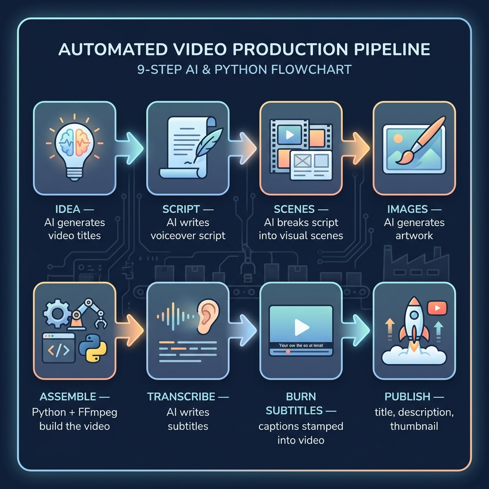

# AI YouTube Video Pipeline

An automated pipeline for producing narrated, subtitled short-form videos - from a single idea prompt to a finished, publish-ready `.mp4`.

**Author:** Engr Braandon



***

## Overview

This project automates the production of AI-narrated motivational/educational videos. A human supplies a topic and a small library of images; the pipeline handles text-to-speech narration, video assembly, transcription, and subtitle burning without manual video editing.

The workflow is split into two categories of steps:

-   **AI-assisted content generation** (title, script, and scene ideation) - driven by a set of structured prompts, run through a general-purpose LLM chat interface.
-   **Automated production** (voice synthesis, video assembly, transcription, subtitle burn-in) - driven by Python scripts in this repository.

***

## Pipeline Architecture

```
1. Idea Generation     →  LLM generates candidate video titles
2. Script Generation   →  LLM converts a title into a full voiceover script
3. Scene Generation    →  LLM breaks the script into discrete visual scene descriptions
4. Image Generation    →  Scene descriptions are rendered as still images (external tool)
5. Motion (optional)   →  Still images are converted to subtly animated clips (external tool)
6. Assembly            →  motivation_agent_v4.py builds Video.mp4 from script + images + TTS
7. Transcription        →  transcribe.py generates subtitles.srt from Video.mp4
8. Subtitle Burn-in    →  burn_subs.py hard-codes subtitles into the final video
9. Publish Metadata    →  LLM generates title, description, and thumbnail concepts
```

Steps 1–5 and 9 are LLM-driven and executed manually via prompts (see [Prompt Library](#prompt-library)). Steps 6–8 are fully scripted and executed via the command line (see [Usage](#usage)).

***

## Repository Contents

| File                                         | Description                                                                                                                                                                                                                                                                         |
|----------------------------------------------|-------------------------------------------------------------------------------------------------------------------------------------------------------------------------------------------------------------------------------------------------------------------------------------|
| `motivation_agent_v4.py`                     | Core pipeline script. Reads `script.txt` and an `images/` directory, generates TTS narration per paragraph, assembles per-paragraph video chunks, and concatenates them into `output/Video.mp4`. Also writes a timing sidecar (`_timings.json`) for downstream subtitle generation. |
| `transcribe.py`                              | Transcribes `output/Video.mp4` into `output/subtitles.srt` using `faster-whisper`.                                                                                                                                                                                                  |
| `burn_subs.py`                               | Hard-codes (burns) the generated subtitles into the final video output. *(Referenced by the pipeline; not included in this repository snapshot - see* [Setup](#setup)*.)*                                                                                                           |
| `script.txt`                                 | Example voiceover script, structured as newline-separated paragraphs.                                                                                                                                                                                                               |
| `IDEA_GENERATION_PROMPT.docx` / `PROMPTS.md` | Prompt library covering idea generation, script writing, scene breakdown, image style, motion, voice direction, and publish metadata.                                                                                                                                               |
| `run_agent.txt`                              | Reference shell sequence for running the full pipeline end to end.                                                                                                                                                                                                                  |

***

## How It Works

### 1. Content Generation (Prompt-Driven)

The prompt library defines four sequential LLM prompts:

-   **Idea Generation** - produces a batch of click-optimized video titles for a defined niche and audience, following explicit constraints (character limits, structural patterns, no repetition).
-   **Script Generation** - expands a single title into a 500–800 word, second-person voiceover script, formatted as 20–30 narratable paragraphs with a defined narrative arc (hook → problem → responsibility shift → action → transformation → close), plus a 30-second outro.
-   **Scene Generation** - decomposes the finished script into discrete visual beats (15–20 spoken words per scene), each paired with a realistic, style-consistent image description.
-   **Publish Metadata** - generates title/description/thumbnail concept pairs optimized for click-through.

These prompts are designed to be pasted into any capable LLM chat interface; they are not called programmatically in this version of the pipeline.

### 2. Video Assembly - `motivation_agent_v4.py`

For each paragraph in `script.txt`:

1.  Synthesizes narration audio via `edge-tts` (voice: `en-US-AndrewNeural`), capturing per-word timing data (`WordBoundary` events) during synthesis.
2.  Selects the next sequential batch of images from `images/` (sorted by file creation time), sized to roughly match the narration duration for that paragraph.
3.  Converts each image into a static video clip via FFmpeg (`1920×1080`, `30fps`, `libx264`).
4.  Concatenates the image clips and merges the narration audio onto the resulting chunk.

All per-paragraph chunks are concatenated into `output/Video.mp4`, and per-word timing data is persisted to `output/_timings.json` so that transcription does not require a second TTS pass.

**Failure handling:** paragraph-level TTS or clip-generation failures are caught and logged; the affected paragraph is skipped rather than halting the run. Temporary per-paragraph assets are cleaned up after each chunk is finalized.

### 3. Transcription - `transcribe.py`

Runs `faster-whisper` against `output/Video.mp4` and writes a standard SRT file. Supports configurable model size (`tiny` → `large-v3`), device (`cpu` / `cuda`), and compute precision, trading off speed against transcription accuracy.

### 4. Subtitle Burn-in - `burn_subs.py`

Takes the final video and the generated SRT file and re-encodes the video with subtitles rendered directly into the frame, ensuring compatibility across platforms that do not support sidecar subtitle tracks.

***

## Requirements

-   Python 3.12+
-   [FFmpeg](https://ffmpeg.org/) and `ffprobe` available on `PATH`
-   Python dependencies:

```bash
pip install edge-tts faster-whisper
```

***

## Setup

```
project/
├── script.txt              # Voiceover script (paragraph-separated)
├── images/                 # Source images (.jpg, .jpeg, .png, .webp)
├── motivation_agent_v4.py
├── output/transcribe.py
├── burn_subs.py
└── output/                 # Generated automatically
```

Place your script at `script.txt` and populate `images/` with the visual assets referenced by your scene breakdown before running the pipeline.

***

## Usage

Run the full pipeline sequentially:

```powershell
python motivation_agent_v4.py
if ($?) { Push-Location output; python transcribe.py; Pop-Location }
if ($?) { python burn_subs.py output/Video.mp4 output/subtitles.srt }
```

Each stage runs only if the preceding stage exits successfully, preventing downstream steps from operating on incomplete output.

### `transcribe.py` options

```bash
python transcribe.py --input Video.mp4 --output subtitles.srt --model small --device cpu
```

| Flag               | Default         | Description                                                        |
|--------------------|-----------------|--------------------------------------------------------------------|
| `--input`, `-i`    | `Video.mp4`     | Source video path                                                  |
| `--output`, `-o`   | `subtitles.srt` | Output subtitle path                                               |
| `--model`, `-m`    | `tiny`          | Whisper model size (`tiny`, `base`, `small`, `medium`, `large-v3`) |
| `--language`, `-l` | auto-detect     | Force a language code (e.g. `en`)                                  |
| `--device`         | `cpu`           | `cpu` or `cuda`                                                    |
| `--compute_type`   | `int8`          | Precision/speed tradeoff (`int8`, `float16`, `float32`)            |

***

## Output

-   `output/Video.mp4` - assembled, narrated video
-   `output/_timings.json` - per-paragraph, per-word timing sidecar
-   `output/subtitles.srt` - generated subtitles
-   Final burned-in video, as produced by `burn_subs.py`

***

## Roadmap

-   End-to-end automation of the content-generation stage (idea → script → scene) via direct API calls, removing manual prompt-copy steps.
-   Content-aware image selection (matching scene semantics to available imagery, rather than chronological cycling).
-   Configurable pan/zoom (Ken Burns) effect for static image clips.
-   Native image generation from within the pipeline, removing the external image-tool dependency.
-   Retry logic for transient TTS/network failures, rather than skip-on-failure.
-   Multi-language script translation, narration, and subtitle generation.
-   Direct YouTube Data API integration for automated upload and metadata publishing.
-   Performance feedback loop: surfacing title/thumbnail engagement data back into the idea-generation prompt.
-   Minimal GUI wrapper around the CLI pipeline.

***
